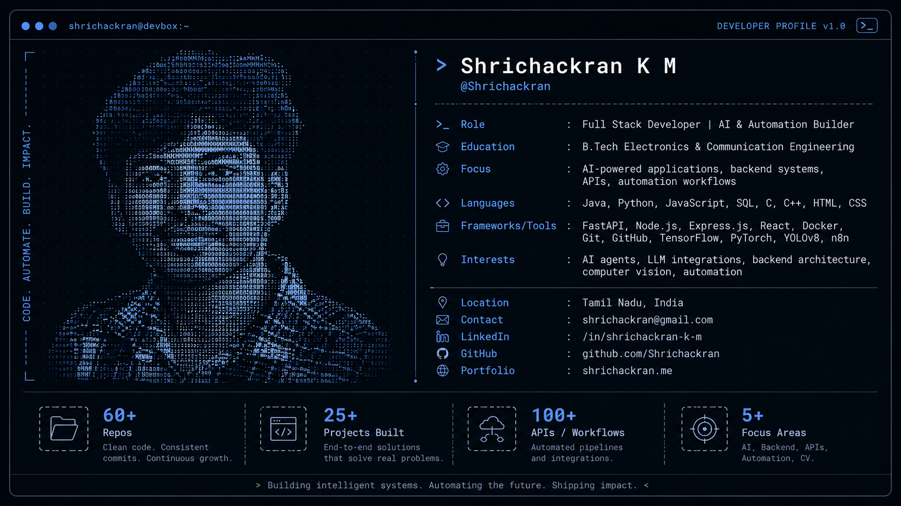
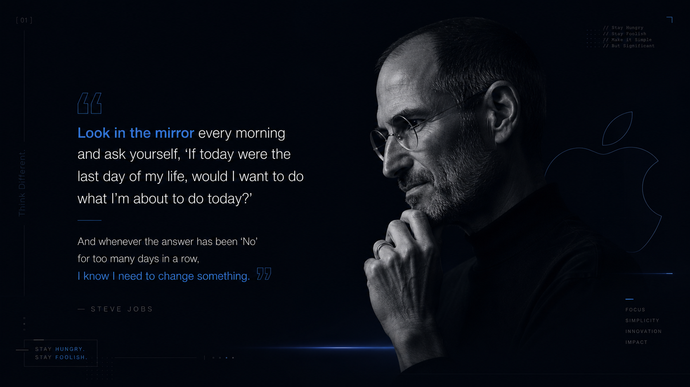

  

## About Me

I am a **Full Stack Developer and AI/Automation Builder** focused on developing reliable backend systems, responsive applications, REST APIs, and intelligent workflows.

- 🎓 B.Tech in **Electronics and Communication Engineering** from SASTRA Deemed University
- 💻 Minor Specialization in **Programming and Application Development**
- 📍 Based in **Salem, Tamil Nadu, India**
- 🧠 Interested in **backend engineering, AI agents, LLM integrations, computer vision, and automation**
- 🚀 Open to **Software Developer, Backend, Full Stack, and AI/ML opportunities**

## Featured Projects

| Project | What I Built | Technologies |
|---|---|---|
| [**Store Intelligence API**](https://github.com/Shrichackran/store-intelligence) | Real-time CCTV retail analytics backend supporting event ingestion, footfall metrics, funnels, heatmaps, and anomaly detection. | FastAPI, SQLite, Docker, YOLOv8, ByteTrack |
| [**LifeLink – Smart Blood Donation Platform**](https://github.com/Shrichackran/LifeLink---Smart-Blood-Donation-Platform) | Full-stack platform for blood-donor matching with location filters, emergency-priority logic, REST APIs, and optimized database queries. | Node.js, Express.js, MySQL, JavaScript |
| [**Speech Denoising and Recognition System**](https://github.com/Shrichackran/Speech-Denoising-and-Recognition-Neural-Network) | AI-enabled workflow combining neural audio denoising, speech recognition, LLM orchestration, and structured post-processing. | Python, TensorFlow, PyTorch, LLM APIs |
| [**JoBzz – Agentic Job Alert System**](https://github.com/Shrichackran/JoBzz-AI-powered-Job-Matching-System) | Automated job-discovery pipeline integrating job data, Google Sheets, filtering logic, and Telegram alerts. | n8n, JavaScript, APIs, Telegram |
| [**WiFi Network Controller**](https://github.com/Shrichackran/Wifi-Network-Controller) | ESP32-based embedded network-control project implementing real-time Wi-Fi access and device-management logic. | C++, ESP32, Embedded Systems |
| [**Interactive Developer Portfolio**](https://shrichackran.me/) | Responsive portfolio showcasing my engineering experience, projects, skills, and contact information. | React, JavaScript, Vercel |

## Technical Stack

### Languages

### Backend, Frontend and Data

### AI, Automation and DevOps

## GitHub Snapshot

## Profile Highlights

| 12 Repositories | 5+ Major Projects | 50+ APIs and Workflow Steps | 5+ Focus Areas |
|:---:|:---:|:---:|:---:|
| Projects and experiments | End-to-end solutions | Endpoints, integrations and automation | AI, Backend, Full Stack, Automation and CV |

## Design Principle I Keep Coming Back To

## Contribution Activity

---

### Building reliable software, learning continuously, and shipping meaningful solutions.

[Portfolio](https://shrichackran.me/) •
[LinkedIn](https://www.linkedin.com/in/shrichackran-k-m/) •
[GitHub](https://github.com/Shrichackran) •
[Email](mailto:shrichackran@gmail.com)

